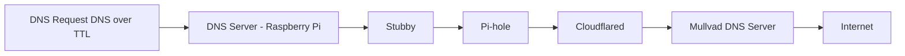
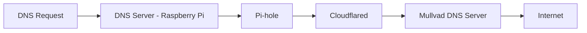

# Secure DNS with your Raspberry (how to install Pi-Hole with DNS over HTTPS)

## High Level Design - System Architecture
The system is based on a *Pi-Hole* server which is offering the **DNS** functionality which is using *Cloudflared* to hide DNS over HTTPS connecting to *Mullvad*.

The system will accept requests **DNS over TLS** thanks to *Stubby* that will redirect the requests to *Pi-Hole* and *Pi-Hole* will send these requests to *Mullvad* using *Cloudflared* and **DNS over HTTP**.

* Stubby
* Pihole
* Cloudflared





## Steps

### Step 1 (configure your SD Card to bool your Raspberry)

Let's start with a fresh image installed with Raspberry Pi Imager, as I am using a *Pi Zero 2 W* so I will install *Raspberry Pi OS Lite 64 bits*.

Remember to configure your WiFi settigns before recording the image. Finish this step putting the image on the Pi.

### Step 2 (update everything)
Start your PI with the flashed card.

Update everything, SO, packages and Firmware:
> sudo apt update && sudo apt full-upgrade -y && sudo rpi-update
> sudo reboot

### Step 3 (install Pi-Hole)
Let's install the main package, *Pi-Hole*
>curl -sSL https://install.pi-hole.net | bash

Select the following wizard options:
* Continue on the static IP (ensure you have a static IP, I do it with a DHCP reservation but it is up to you).
* Upstream DNS: select Custom
* Enter the following IP address (we will change all this afterwards): 194.242.2.2
* Enable query loging to allow for better statistics recording everything (this is all optional, you can use your criteria here).

You should have now the pihole server installed. Configure the password for your webserver doing the following:
>sudo pihole setpassword *yourpassword*

Access its own URL **ipaddress/admin** and navigate to the *Lists* section of the menu. There add these two new lists to block:
>https://big.oisd.nl

>https://energized.pro/ultimate/hosts.txt

After doing this update the gravity with:
>sudo pihole -g

### Step 4 (prepare the context to properly run  Pi-Hole)
Things pending: 
- to generate SSL certificate and ensure that the server can be accessed internally and externally
- ensure that there is no degradation overtime on the performance (log management & rotation?)

As Pi-Hole performance can degrade over time due to multiple reasons and as we are running on low specs hardware let's ensure we get the system always as performant as today:

Edit `/etc/pihole/pihole-FTL.conf`and setup the following values:

```  bash
MAXDBDAYS=7
MAXLOGAGE=72
```
This will ensure that the system performs overtime but will prevent us from having statistics for longer than a week. You can  teak the `MAXDBDAYS` value upon your specific needs.

Another thing to protect your system is to ensure that  no log file grows unlimited generating issues with free space. To do it create a file called `/etc/logrotate.d/custom-logs` with the following content.

``` bash
/var/log/*.log  {
size 10M
rotate  5
compress
missingok
notifempty
create  0640  root  adm
}
```
Last but not least, given the hardware being used restarting the server weekly will help to keep the performance stable. I suggest doing it with cron like this:
>sudo crontab -e
>0 4 * * 0 systemctl restart pihole-FTL


